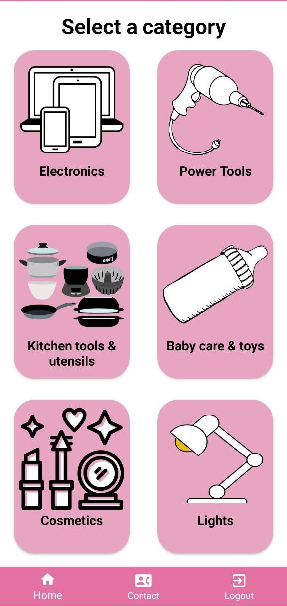
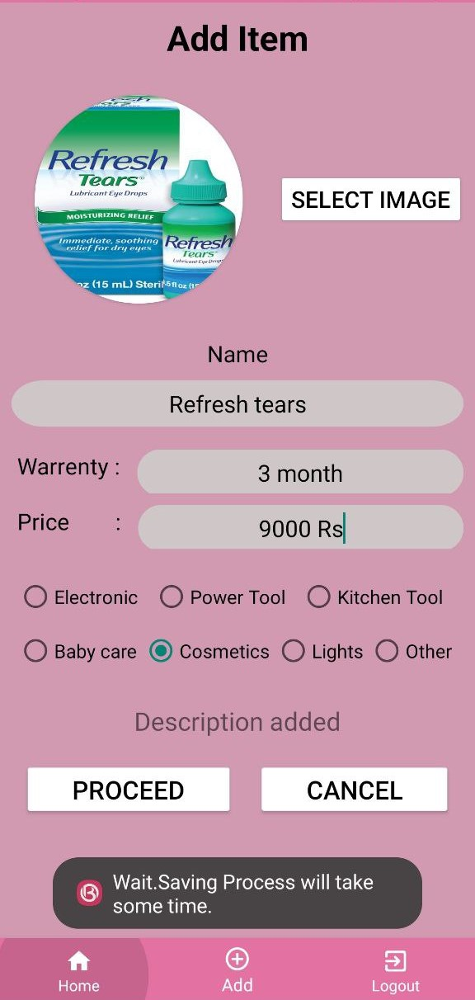
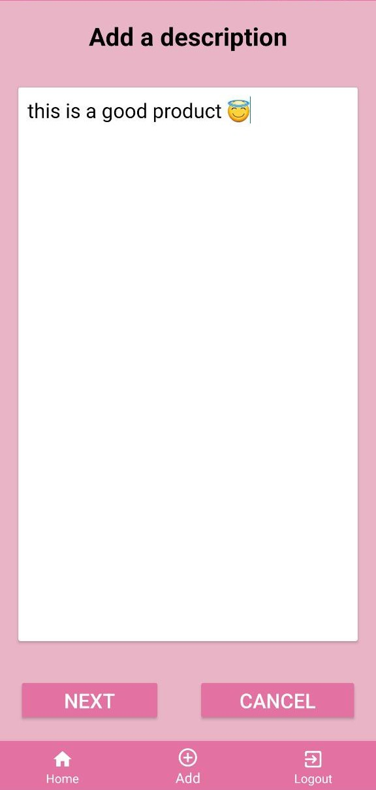

# Online Beams - A whatsapp based e-commerce app

This app can be used to buy things using whatsapp. This app can be used by small-scaled startup business. This app is designed to decrease the cost of cloud database by a certain amount.

Screenshots :

Functions that can be done,

- Admin can add thigs of varius categories
- Admin can edit those added items
- User can select the item and the order will be sent to the owner using whatsapp
- Search bar is added

Future implementations,

- cart functions
  
When building this project,we used the following technologies,

- Android studio
- Kotlin
- Firebase realtime database, storage

## Author

👤 **Abinayan Ratnasingam**

- Github: https://github.com/AbinayanRatna
- LinkedIn: https://www.linkedin.com/in/abinayan-ratnasingam-5092b3214/

## Show your support

Give a ⭐️ if this project helped you!
